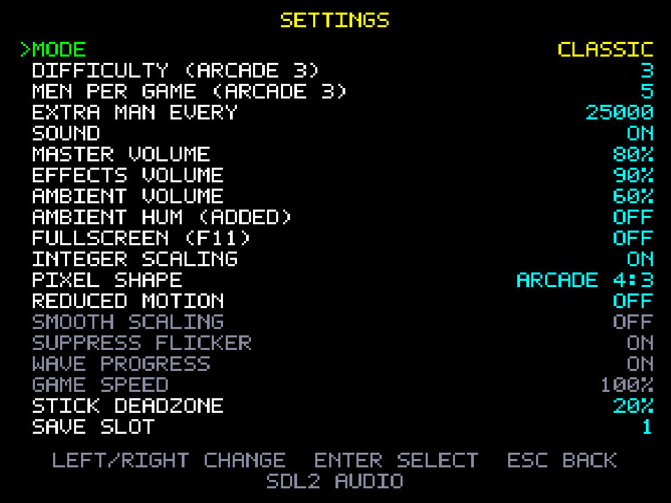

# Controls

The cabinet had two 8-way joysticks: the left one moves and the right one fires, in any of eight
directions, for as long as it is held. There is no fire button. Both keyboard and gamepad keep that
layout.

## Keyboard (default bindings)

| Action | Keys |
|---|---|
| Move | `W` `A` `S` `D` (diagonals by holding two) |
| Fire (continuous while held) | `↑` `←` `↓` `→` (diagonals by holding two) |
| Start / confirm | `Enter`, `Space` |
| Pause / back | `Esc`, `P` |
| Fullscreen | `F11` |
| Help / control reminder | `F1`, `H` |

- Holding two opposite keys on the same stick (e.g. `A`+`D`) cancels that axis, as on the arcade (MAME behaves the same way).
- Firing starts 2 frames after the fire direction settles, then repeats every 8 frames, with at most 4 shots on screen.

## Gamepad (SDL2 GameController: Xbox, PlayStation, Switch Pro and most others)

| Action | Control |
|---|---|
| Move | left stick or d-pad |
| Fire | right stick |
| Start / pause | Start (Menu) |
| Confirm in menus | A / Cross, or Start |
| Back in menus | B / Circle, or Back/View |
| Help | Y / Triangle |

**Stick handling by mode:**
- **Classic:** both sticks snap to 8 directions in 45° sectors, as the arcade's switch sticks did.
- **Modern:** the move stick is analog (speed scales with deflection, up to the arcade's speed), and the fire stick aims at any angle.

**Other details:**
- The deadzone is radial and defaults to 20%. Change it under *Settings → Stick deadzone*.
- Pads can be plugged in or out at any time.
- Only the first connected pad is used.
- Gamepad support needs the bundled SDL2 library. If it can't load, the game says so in *Settings* and keyboard play still works.

## Remapping keys

*Settings → Remap keys…*:

1. Select an action and press `Enter`.
2. Press the new key.

- `Esc` cancels.
- A key can only drive one action; binding it to a new action removes it from the old one.
- *Reset to defaults* restores the table above.
- Bindings are saved in `settings.json` (see [SAVES.md](SAVES.md)).
- Gamepad buttons are not remappable yet (see KNOWN_ISSUES.md).

## Menus

- Navigate with the move or fire keys, the d-pad, or either stick.
- `Enter` / A confirms.
- `Esc` / B goes back.
- On the title screen, left/right on **MODE** toggles Classic / Modern.
- On the title screen, left/right on **START WAVE** picks the wave a new game starts on (1–99, wrapping), and `Enter` on that row starts the game. Starting past wave 1 is *practice*: the HUD shows `PRACTICE` and the score doesn't enter the high-score table.

## High-score initials

- Type letters directly, or use `↑`/`↓` (stick up/down) to cycle through the letters.
- `→` or `Enter` locks a letter.
- `Backspace` steps back.
