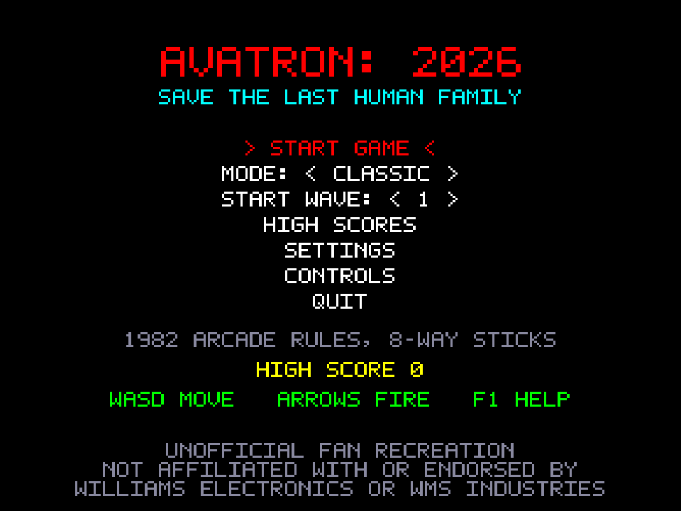
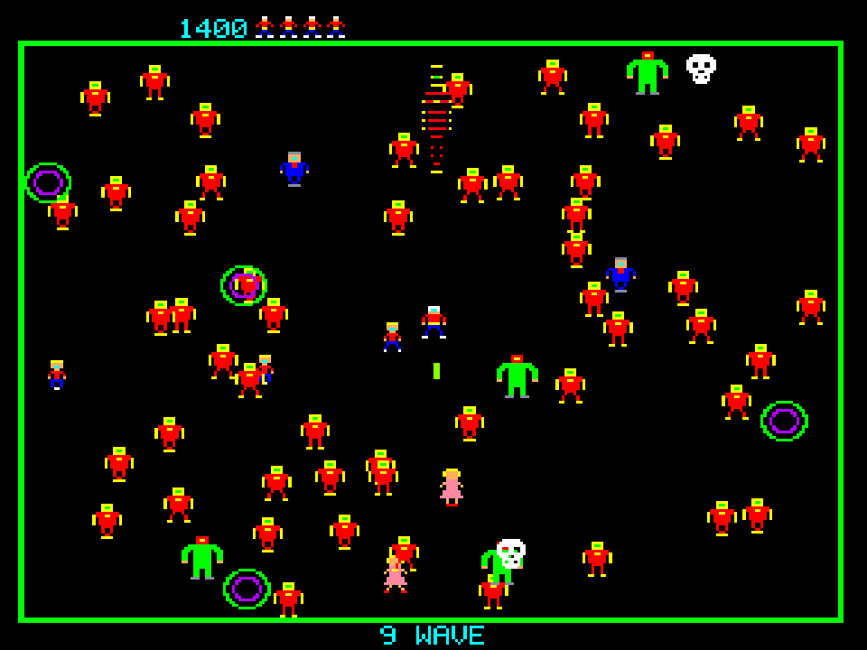
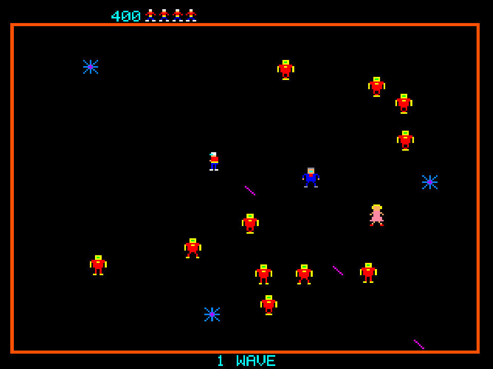
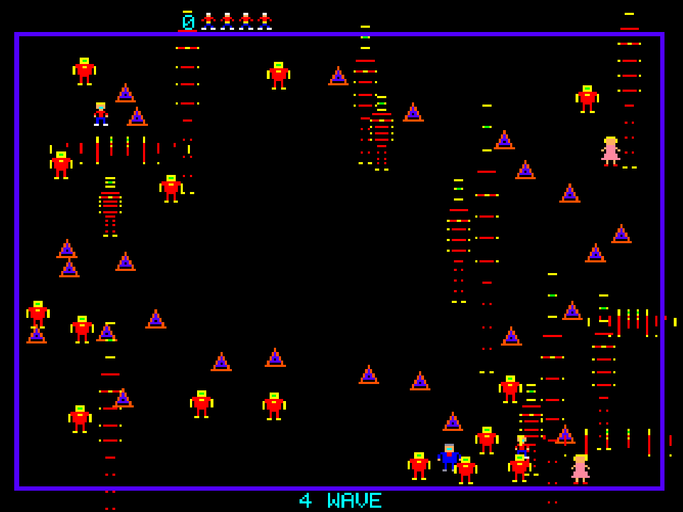
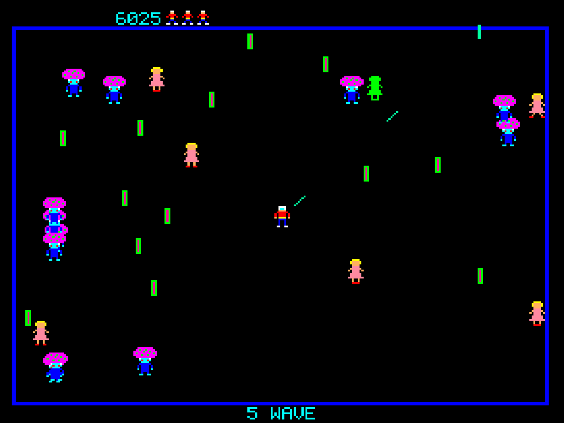
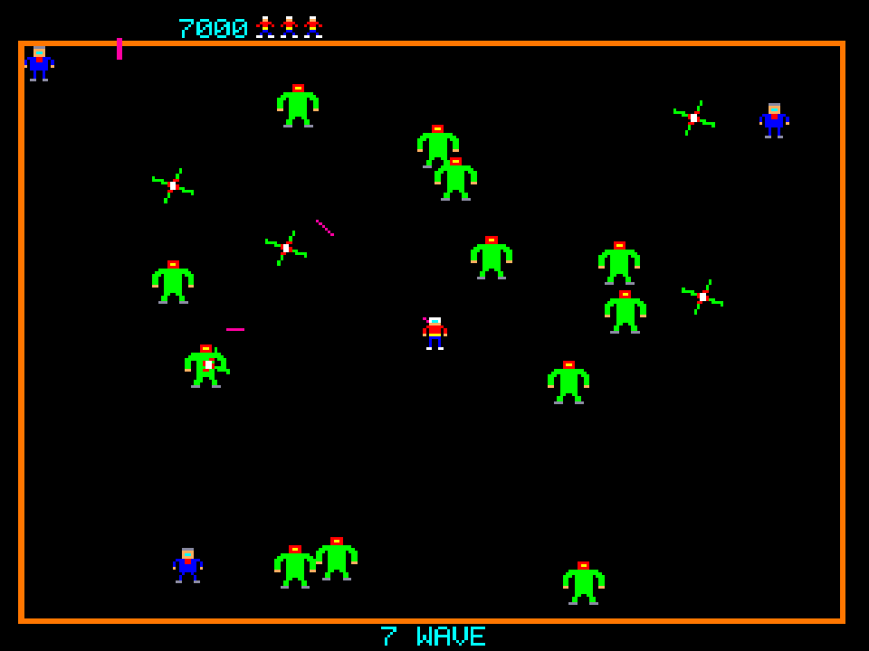
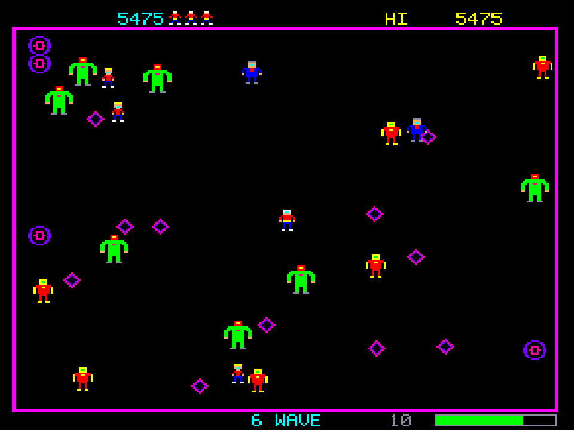
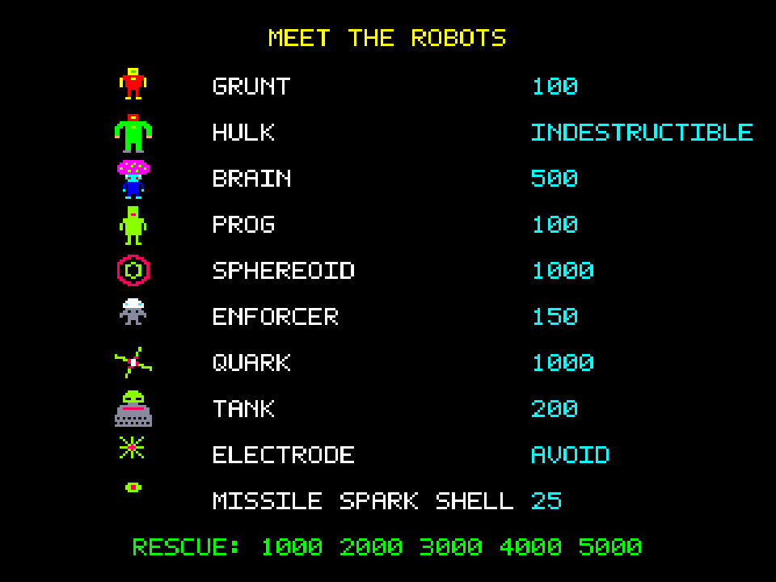
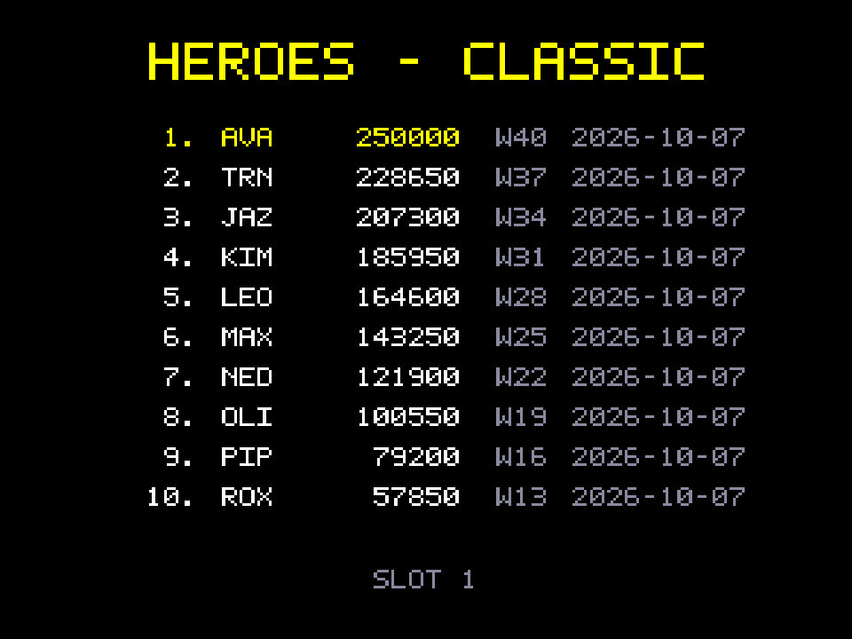

# AVATron: 2026

**AVATron: 2026** is a twin-stick arena shooter written in C# on **.NET 10** with an **Avalonia 12**
desktop front end. It faithfully recreates the gameplay of the 1982 Williams Electronics / Vid Kidz
arcade game *Robotron: 2084*, with optional modernisations.

> Unofficial fan project. Not affiliated with or endorsed by Williams Electronics, WMS Industries,
> Midway, Warner Bros. or the original authors. "Robotron" is a trademark of its owner and is used
> here only to describe the game being recreated. All graphics and sounds in this repository are
> original work (see [THIRD_PARTY.md](THIRD_PARTY.md)); no ROM data is included. Product naming lives
> in `src/AVATron.Avalonia/Shell/Branding.cs`.

<p align="center">
  
  
</p>

Two presets share one engine:

- **Classic**: the arcade program's rules as documented from its source and from MAME. That means 8-way twin sticks, 60.096 Hz logic, the 40-wave table that loops waves 21–40, factory operator settings, single-channel priority sound and a flicker approximation.
- **Modern**: the same game with usability changes. It adds analog twin-stick aiming, no flicker, an optional wave-progress meter, an adjustable game speed, suspend/resume, and polyphonic audio.

See [FIDELITY.md](FIDELITY.md) for exactly what differs.

## Screenshots

| | |
|---|---|
|  |  |
| **Wave 1**: grunts, electrodes and the last human family | **Wave start**: enemies materialise with a line-spread effect |
|  |  |
| **Brain wave**: brains reprogram humans into progs | **Quark wave**: quarks drop tanks while hulks roam |
|  |  |
| **Modern mode**: high score and wave-progress meter on the HUD | **Attract mode**: the enemy roster |
|  |  |
| **Hall of heroes** (sample entries) | **Settings**: audio, display, operator adjustments, key remapping |

Screenshots come straight from the game's renderer at 3× with the arcade's 4:3 pixel shape. Regenerate them with
`dotnet run --project tools/AVATron.Screenshots`, which uses fixed seeds so the results are reproducible.

## Prerequisites

| | Version | Notes |
|---|---|---|
| .NET SDK | 10.0.x (validated with 10.0.400) | `global.json` pins 10.0.400, with `latestFeature` roll-forward |
| OS | Windows 10+, Linux (X11/XWayland), macOS 12+ | Only Linux aarch64 has actually been run (see [KNOWN_ISSUES.md](KNOWN_ISSUES.md)) |
| SDL2 | bundled | The NuGet package ships SDL2 natives for win-x64/arm64, linux-x64/arm64 and osx. Without it the game still runs, just without sound or gamepad |

## Build, run, test

```bash
dotnet build                       # whole solution
dotnet run --project src/AVATron.Avalonia
dotnet test                        # 132 headless tests (engine, persistence, audio mixer, app flow, Avalonia headless UI)
```

Command-line options for the game:

| Option | Effect |
|---|---|
| `--windowed` | ignore the saved fullscreen setting |
| `--no-audio` (or `AVATRON_NO_AUDIO=1`) | don't open an audio device |
| `--no-gamepad` | don't initialise SDL game controllers |
| `--start-wave <1-99>` | practise from a chosen wave (same as *START WAVE* on the title menu; remembered) |
| `--data-dir <path>` (or `AVATRON_DATA_DIR`) | store settings, scores and suspend files elsewhere |
| `AVATRON_DEBUG_KEYS=1` | log key events to stdout |

## Downloads

Every push to GitHub builds a **self-contained single-file** version for each supported platform. No .NET install is needed: unzip or untar, then run `AVATron` (`AVATron.exe` on Windows).

- **Latest `main` build:** the rolling [`latest` pre-release](../../releases/tag/latest), refreshed on every push to `main`.
- **Versioned releases:** pushing a tag such as `v0.1.0` creates a proper release.
- **Any branch:** its builds are attached to that workflow run under *Actions*.

| Platform | File |
|---|---|
| Windows x64 / x86 / ARM64 | `AVATron-win-x64.zip`, `-win-x86.zip`, `-win-arm64.zip` |
| Linux x64 / ARM64 / ARM32 (glibc) | `AVATron-linux-x64.tar.gz`, `-linux-arm64.tar.gz`, `-linux-arm.tar.gz` |
| macOS Intel / Apple Silicon | `AVATron-osx-x64.tar.gz`, `-osx-arm64.tar.gz` |

- musl-based Linux (e.g. Alpine) isn't offered, because SDL2's package has no musl build.
- The macOS builds are a plain executable: there's no `.app` bundle and no code signing, so Gatekeeper asks you to allow them.
- Only the linux-arm64 single file has been launched so far (Arch Linux aarch64, with audio working). The others are built by CI but haven't been run.

## Publishing locally

```bash
build/publish.sh                       # all eight targets, same flags as CI
build/publish.sh win-x64 linux-x64     # selected targets
pwsh build/publish.ps1 -Rids win-x64   # from Windows
```

Output goes to `publish/<rid>/`: a single `AVATron` executable (about 47 MB for linux-arm64) plus README, THIRD_PARTY and LICENSE.

## Where things are

| Doc | Contents |
|---|---|
| [RESEARCH.md](RESEARCH.md) | research dossier, source ledger, confidence levels, open questions |
| [FIDELITY.md](FIDELITY.md) | reference version, fidelity matrix, Classic and Modern guide |
| [ARCHITECTURE.md](ARCHITECTURE.md) | projects, tick order, entity lifetime, rendering, input, audio |
| [CONTROLS.md](CONTROLS.md) | keyboard and gamepad reference, remapping |
| [SAVES.md](SAVES.md) | file formats, locations, schema versions |
| [THIRD_PARTY.md](THIRD_PARTY.md) | dependencies, licences, asset provenance |
| [KNOWN_ISSUES.md](KNOWN_ISSUES.md) | unverified behaviour, platform caveats, deferred work |
| [MILESTONE_STATUS.md](MILESTONE_STATUS.md) | what is done, tested, observed, and still open |
| `docs/research/` | the detailed research notes with line-level citations |

## License

The project's own code, art and sounds are released under the [MIT License](LICENSE).
Third-party components keep their own licences (see [THIRD_PARTY.md](THIRD_PARTY.md)). The MIT licence
covers only this project's work. It grants no rights to the original *Robotron: 2084* or its trademarks.
